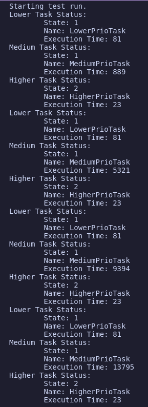
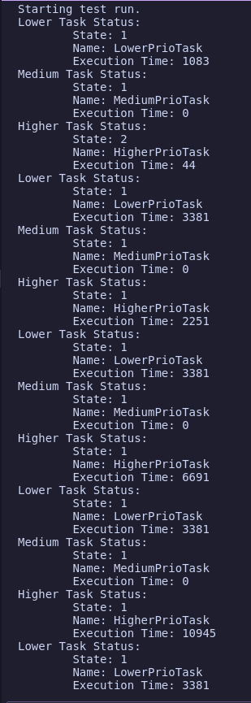

# Lab 06

Status Badge: 

By Ian Smith and Kasey Kemp

Lab06 stuff goes here.

## Activity 0

---

For this activity we were asked to setup three threads, where the lower priority thread takes a lock and holds it, a high priority thread tries to take that lock after a delay, and a medium priority lock executes some code.

We found that the higher priority thread was blocked while the lower priority thread kept the lock, which resulted in the medium priority thread being ran for a majority of the time.

This is an example of priority inversion.

## Activity 1

---

For this activity we were asked to replicate activity 0 but use xSemaphoreCreateMutex() instead of xSemaphoreCreateBinary(). Since
a mutex allows for priority inheritance, the lower prority task will no longer be starved by the medium priority task and will actually complete its work.
This allows it to finally give up the lock and allow the higher priority task to run until completion. This means the medium priority task does not get execution time in our example.

## Activity 2
